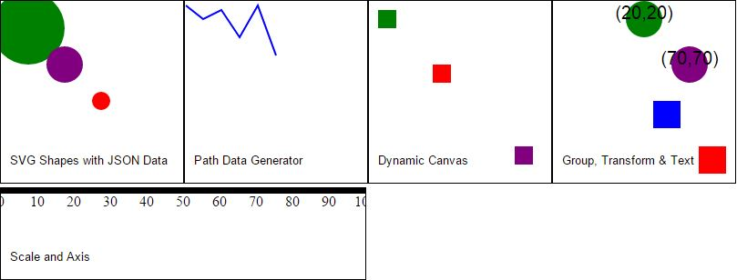

# D3-Playground
This is a repository for learning D3.js.   
I learned D3 in a rush last year, by scanning through a bunch of tutorial videos and making use of online resources. This did help me get something shown on the screen quickly, but it was inevitable that I got stuck while doing projects that's just a bit more complex, because of not understanding the underlying principles of D3.

###[DashingD3.js](https://www.dashingd3js.com/table-of-contents)
This is a very basic text-based tutorial on D3. It's wonderful, detailed and it's free (Yay, since I have no money to pay for the video trainings).  
I had a lot of questions answered by this tutorial, including things about 
* [binding data to DOM elements](https://www.dashingd3js.com/binding-data-to-dom-elements): *\__data\__ explains everything!*
* [paths](https://www.dashingd3js.com/svg-paths-and-d3js): How's a svg path different from a svg line? *Very different.* What is d3.svg.line()? *It is a function to transform json data to mini-language.*
* [scale](https://www.dashingd3js.com/d3js-scales): This is a simple but magic figure. 
* [axis](https://www.dashingd3js.com/d3js-axes)

I've made some examples, mostly according to the tutorial. [Here](DashingD3/)

